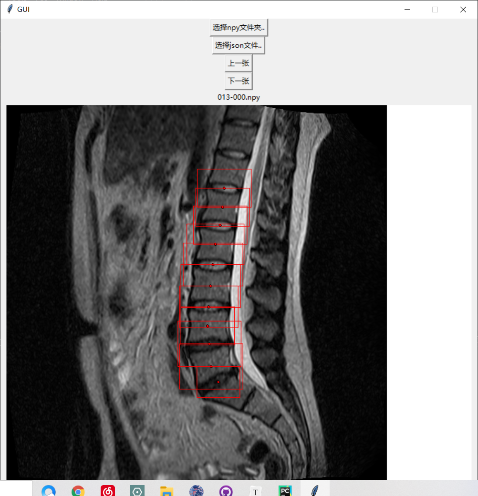

# 数据处理部分

## 检测部分(yolo)

首先整理了原始数据集，按照更加清晰明了的格式将label整理为json格式，并且储存为label-all-data.json。

同时，对于原有的dcm文件，直接提取像素矩阵储存为npy文件，既压缩了空间又方便了数据加载。使用GUI.py可以看到框的具体样子，便于分析数据，GUI程序运行效果如下所示：



选取YOLOv5作为检测模型，利用npy2yolo.py生成yolo格式的标签数据。框的生成方式参考[第一名方案](https://img-blog.csdnimg.cn/img_convert/9cefbf463c5710a05fc628cd30a7ab4e.png)，分类编号参考自[第六名方案](https://img-blog.csdnimg.cn/img_convert/1c962f5d8253f996e2d7189edec0b8e3.png)。将文件整理成yolo格式(文件树如下所示)。

```tex
└── yolo-data
    ├── images
    |	└── train
    |	└── val
    |	└── test
    └── labels
    	└── train
    	└── val
    	└── test
```

以上提及的label-all-data.json、npy文件和yolo-data皆在压缩包data.zip内，~~解压后即可获得对应文件~~为减小仓库大小，将data.zip上传至网盘。

data.zip下载地址1：https://pan.baidu.com/s/12vqIw3zB5pj4-q4LmcvGBQ (提取码：x941) 

data.zip下载地址2：https://drive.google.com/file/d/1-LxbG3N1Eem7wrBYALvoSfMcq_1berKt/view?usp=sharing

## 分类部分(resnet)

图像分类部分对数据的处理主要有两点：

* 按照检测部分的框进行切割得到不同类别的图像
* 进行数据增强，主要做的方法是中心点抖动和加高斯噪声

主要介绍第二点。因为检测部分划分的框可能并不准确，其中心点与GT有着一定程度的偏移，因此在切割的时候对中心点进行四个方向上的偏移，这样不仅能增大数据量，同时也能让模型更好地学习到不同视野下的分类目标。同时，由于给定数据中存在明显的类别不均衡现象，我们利用高斯噪声进行增广，使得各类别数据的数量相对均衡。

利用data_enhance.py结合特殊处理后的new_data-bbox-cls.json文件，就可以对给定的images/train文件夹进行数据处理，生成result文件夹，含有增强后的各类别图像。