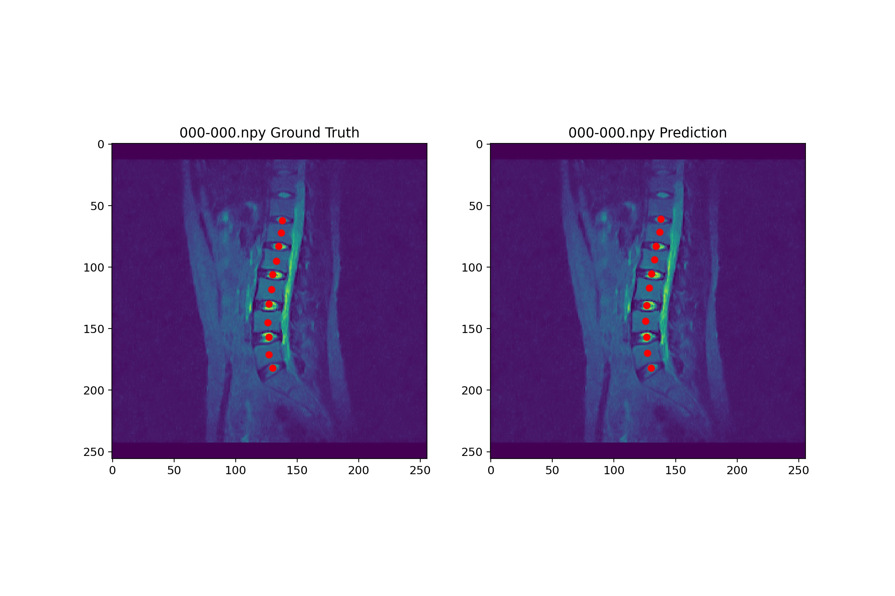
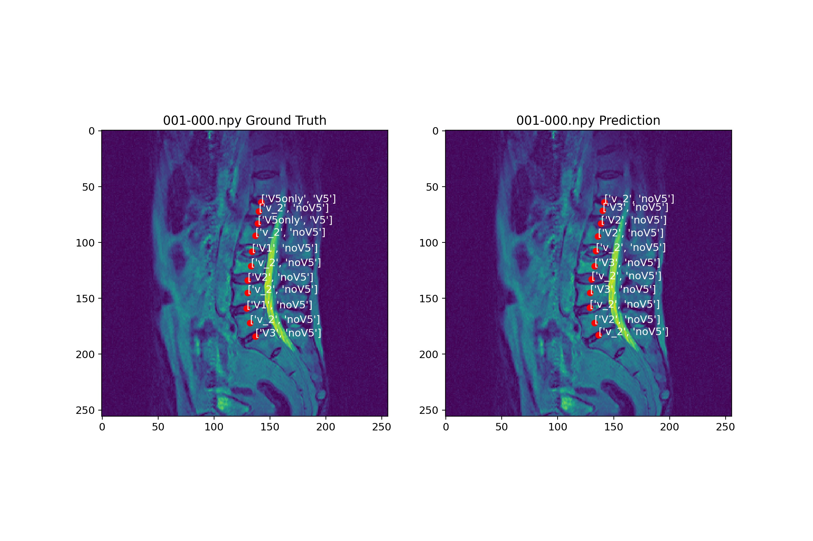

# demo

该部分用于展示检测以及分类的结果，主要有以下两个功能：

* 对指定编号的数据进行检测并且标记中心点
* 对检测得到的各个中心点对应区域进行分类，并且输出结果

## 运行方法

第一步，下载预训练模型文件，放置到models目录下。

下载地址1：https://pan.baidu.com/s/19txniILPfjdKRi31Byxm7A (提取码：rilu)

下载地址2：https://drive.google.com/file/d/1AqfOtvDZuDyvFo1eUpmcMqfUsDApq5Nz/view?usp=sharing

第二步，将PreProcessing部分得到的npy文件放置在label-all-npy目录下，并且确认demo.py内路径无误后，运行下列命令：

```bash
python demo.py --index 123 --show_label
```

即可在命令行中得到序号123的数据的各区域分类结果以及对应的真实结果，同时可以在result目录下看到保存的对应结果，其中，--show_label表示是否在输出图像中显示分类结果。示例如下：



